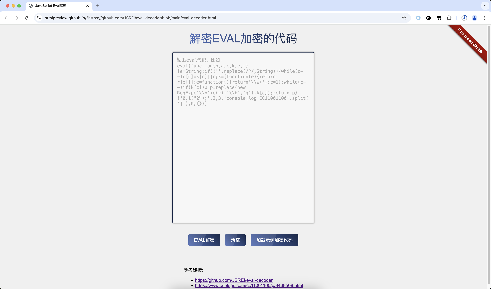

# Eval Encryption and Decryption Principles and Tools

GitHub Repository: [https://github.com/JSREI/eval-decoder](https://github.com/JSREI/eval-decoder)

[简体中文](./README.md) | English

## 1. Online Decryption

Click the link to enter the online decryption page:

[https://htmlpreview.github.io/?https://github.com/JSREI/eval-decoder/blob/main/eval-decoder.html](https://htmlpreview.github.io/?https://github.com/JSREI/eval-decoder/blob/main/eval-decoder.html)



## 2. Principle Exploration: JSPacker Compression and Decompression Study (js eval)

### 2.1 Cause

While studying web crawlers, I found that many websites had the same type of JS obfuscation, and the names were all pde.js. I suspected that the same obfuscation tool was used, so I decided to research it.

This tool is called JS Packer, which is not a dedicated obfuscation tool but a JS compression tool. Its official website address is: [http://dean.edwards.name/packer/](http://dean.edwards.name/packer/)

It supports two compression methods. One is the conventional Shrinking variables, which removes whitespace and comments, etc. The other is Base62 encoding, which is suitable for compressing content with a high repetition rate of words.

### 2.2 Compression Example

All discussions are based on the Base62 encode compression method. Input:

``` js
alter("hello, world");
```

Output:

```js
eval(function(p,a,c,k,e,r){e=String;if(!''.replace(/^/,String)){while(c--)r[c]=k[c]||c;k=[function(e){return r[e]}];e=function(){return'\\w+'};c=1};while(c--)if(k[c])p=p.replace(new RegExp('\\b'+e(c)+'\\b','g'),k[c]);return p}('0("1, 2");',3,3,'alter|hello|world'.split('|'),0,{}))
```

Formatted:

```js
eval(function (p, a, c, k, e, r) {
    e = String;
    if (!''.replace(/^/, String)) {
        while (c--) r[c] = k[c] || c;
        k = [function (e) {
            return r[e]
        }];
        e = function () {
            return '\\w+'
        };
        c = 1
    }
    ;
    while (c--) if (k[c]) p = p.replace(new RegExp('\\b' + e(c) + '\\b', 'g'), k[c]);
    return p
}('0("1, 2");', 3, 3, 'alter|hello|world'.split('|'), 0, {}))
```

The code above may look intimidating, but the principle is quite simple. Let's analyze it patiently.

### 2.3 Compression Principle:

In simple terms, it compresses the same words by extracting all words as a dictionary and then changing the places in the source code that represent words to reference the index of the dictionary. This method works well when there are many repeated words, but it may not be worth it when there are few repeated words.

Let's analyze with specific data, such as the following code:

```js
console.log("aaaaa");
console.log("aaaaa");
console.log("bbbb");
```

Formatted after compression:

```js
eval(function(p, a, c, k, e, r) {
    e = String;
    if (!''.replace(/^/, String)) {
        while (c--) r[c] = k[c] || c;
        k = [function(e) {
            return r[e]
        }];
        e = function() {
            return '\\w+'
        };
        c = 1
    };
    while (c--) if (k[c]) p = p.replace(new RegExp('\\b' + e(c) + '\\b', 'g'), k[c]);
    return p
} ('0.1("2");0.1("2");0.1("3");', 4, 4, 'console|log|aaaaa|bbbb'.split('|'), 0, {}))
```

The pattern is already very clear. The numbers in the first parameter '0.1("2");0.1("2");0.1("3");' correspond to the indices in 'console|log|aaaaa|bbbb'.split('|'). When decompressing, you just need to restore the numerical indices to words.

Here is a simple interpretation of the decompression algorithm:

```js
// p The compressed content where all words in the original content are replaced with dictionary indices
// a Dictionary size, not used for now
// c Dictionary size, used to associate compressed content with the dictionary during decompression
// k Dictionary
// e During decompression, if the second argument of replace supports function, it is \\w+, otherwise it is the string corresponding to the index
// r Used to save the dictionary when speeding up decompression
eval(function(p, a, c, k, e, r) {
    e = String;

    // Detect whether the current browser supports replace(regex, function), which can speed up decompression if supported
    // If not supported, this part can be ignored directly
    if (!''.replace(/^/, String)) {

        // Copy a compressed word because k has other uses
        while (c--) r[c] = k[c] || c;

        // k[0] is later used to find the replacement string for each matched index
        k = [function(e) {
            return r[e]
        }];

        // Used to split the original content
        e = function() {
            return '\\w+'
        };

        // When accelerating decompression, it is equivalent to changing while to if
        c = 1
    };

    // Use the dictionary to expand the compressed index code. If there is no acceleration above, c equals the number of dictionary words, and each one needs to be replaced one by one
    // If replace(string, function) is supported, it will pass each matched number to k[c] to get the string it should be replaced with
    while (c--) if (k[c]) p = p.replace(new RegExp('\\b' + e(c) + '\\b', 'g'), k[c]);

    // Complete decompression
    return p
} ('0.1("2");0.1("2");0.1("3");', 4, 4, 'console|log|aaaaa|bbbb'.split('|'), 0, {}))
```

### 2.4 Decompression Tool

I call this form of eval(blablabla…) eval compression and have written a simple decompression tool for it.

Thoughts:

1. Since this is definitely going to be executed on the web page, it can be simulated by just executing it.

2. There may be more than one layer of eval, so it should be easy to perform multiple consecutive evals.

The HTML code is as follows:

```html
<html lang="zh">
<head>
    <meta charset="UTF-8">
    <title>JavaScript Eval Decryption</title>
</head>
<body>

<label for="eval_code">Eval encrypted code:</label><textarea id="eval_code" cols="100" rows="30"
                                                        placeholder="Paste eval code"></textarea>
<button onclick="executeEval()">EVAL Decryption</button>

<script type="text/javascript">

    // Hook coverage

    // This placeholder is relatively large, set it through JS
    (function () {
        const placeholder = `Paste eval code, for example:
eval(function(p,a,c,k,e,r){e=String;if(!''.replace(/^/,String)){while(c--)r[c]=k[c]||c;k=[function(e){return r[e]}];e=function(){return'\\\\w+'};c=1};while(c--)if(k[c])p=p.replace(new RegExp('\\\\b'+e(c)+'\\\\b','g'),k[c]);return p}('0.1("2");',3,3,'console|log|CC11001100'.split('|'),0,{}))`;
        document.getElementById("eval_code").setAttribute("placeholder", placeholder);
    })();

    function executeEval() {
        let evalCodeElt = document.getElementById("eval_code");
        let evalCode = evalCodeElt.value;
        // If the beginning eval is not removed, it will be executed twice directly
        evalCode = evalCode.replace(/^eval/, "");
        if (!evalCode) {
            alert("Please paste the Eval encrypted JavaScript code in the text box!");
            return;
        }
        try {
            evalCodeElt.value = eval(evalCode);
        } catch (e) {
            alert("An error occurred during execution: " + e);
        }
   
 }
</script>
</body>
</html>
```

The effect is as follows:


## 3. Reference Materials

- [https://www.cnblogs.com/cc11001100/p/8468508.html](https://www.cnblogs.com/cc11001100/p/8468508.html)

## 4. Reverse Engineering Technical Exchange Group

Scan the code to join the reverse engineering technical exchange group:


If the group QR code has expired, you can add my personal WeChat and send [Reverse Group] to pull you into the group:


[Click here](https://t.me/jsreijsrei) or scan the code to join the TG exchange group:


